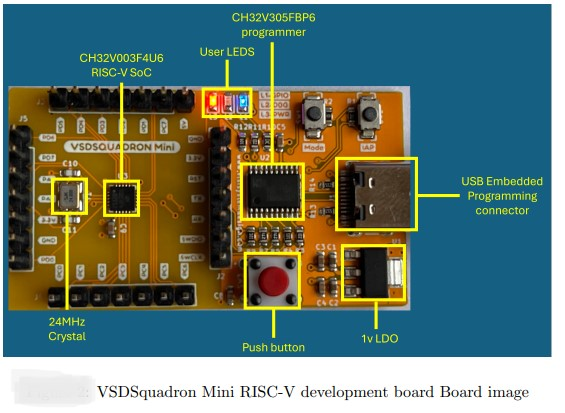
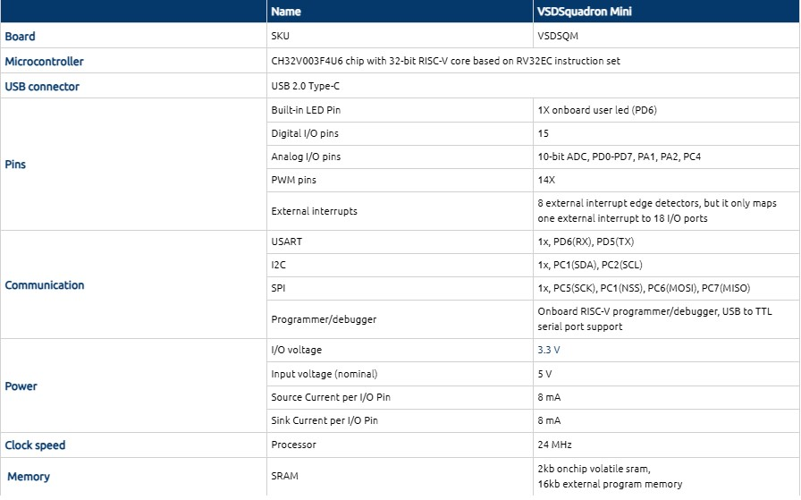
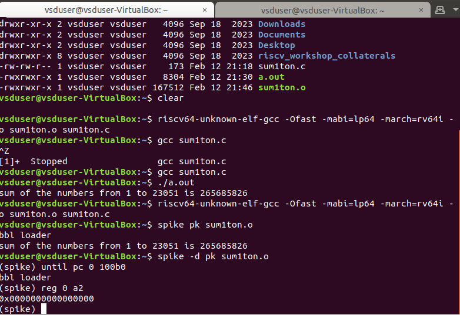

# samsung-riscv
# VSD Squadron-Mini-(RISC-V)-REASEARCH INTERNSHIP
##  Basic Details

**Name:** Amalkrishna

**College:** Sri Sathya Sai Institute of higher Learning

**Email ID:** akrishna9k@gmail.com  

**GitHub Profile:** [Amalkrishnagit](https://github.com/Amalkrishnagit)

**LinkedIN Profile:** [Amalkrishna AK](https://www.linkedin.com/in/amalkrishna-ak)

## Overview
The VSDSquadron Mini Internship 2025 is an intensive, short-term internship program designed to provide participants with hands-on experience in the fields of VLSI design, semiconductor technology, and related domains. Tailored for engineering students, recent graduates, and aspiring technologists, this program bridges the gap between academic knowledge and industry-ready skills.

 <p align="center">
	 
	 
</p>

The VSDsquadron Mini is a compact RISC-V development board designed for hobbyists, educators, and engineers. It features a powerful RISC-V microcontroller, offering a balance of performance and energy efficiency. Equipped with essential peripherals like GPIOs, UART, I2C, SPI, and ADC, it supports a wide range of applications, from IoT projects to embedded systems development. The board is USB-programmable, making it beginner-friendly, and is compatible with popular development tools and open-source resources. Its small form factor and versatility make it an ideal choice for learning RISC-V architecture and prototyping innovative designs.The board is powered by CH32V003F4U6 chip with 32-bit RISC-V core based on RV32EC instruction set, optimized for high-performance computing with support for 2-level interrupt nesting and supports 24MHz system main frequency in the product function.Includes a built-in factory-trimmed 24MHz RC oscillator and a 128kHz RC oscillator, plus an external 24MHz oscillator option for varied clocking requirements.Boasts 3 groups of GPIO ports, totalling 15 I/O ports, enabling extensive peripheral connections and mapping to external interrupt capabilities.Offers multiple communication protocols including US- ART, I2C, and SPI for versatile connectivity options.Equipped with 2KB SRAM for volatile data storage, 16KB CodeFlash for program memory, and additional 1920B for bootloader functionalities.Features on-board CH32V305FBP6 single-wire programming protocol, enhancing development efficiency with seamless code deployment and debugging. NO NEED to purchase any additional adapter.
 <p align="center">
	 
	 
</p>


-------------------------------------------------

<details>
<summary><b>Task 1:</b> The Objective of Task-1 is to watch lab videos that are based on C and RISC-V and then use the gcc and risc-v compilers to compile the C code</summary>

### C Language based LAB
We have to follow the given steps to compile any **.c** file in our machine:  
1. Open the bash terminal and locate to the directory where you want to create your file. Then run the following command:

	```
	gedit sum.c or leafpad sum1ton.c
	```  
2. This will open the editor and allows you to write into the file that you have created. You have to write the C code of printing the sum of n numbers. Once you are done with your code, save your file, and then close the editor.

Installing Leafpad editor
 

 

Creating a file named "sum1ton.c"

 

A C-programme is written to find the sum of numbers from 1 to n, and the programme is executed.
 

4. To the C code on your terminal, run the following command:

	```
	gcc sum.c/gcc sum1ton.c
	./a.out
	```
### C Code compiled on gcc Compiler:

 The programme is then compiled using the gcc compiler.

 


 


Cross-verification of the output of the programme.

 


Updating the written programme to start a new command in the next line.


 

We can see that the next command starts in a new line.
 

Playing around with the programme.

 


 

Renaming the written programme from sum1ton.c to lab1sum1ton.c via the terminal.

 

The clear screen command -clear.
 
 

### Compiled C output:
 
Compiling the written programme using Risc-V compiler.
 


The objectdump command is employed , and filtered out the main section which was found to have 17 instructions.
 

Cross-verification of the number of instructions.
 


 
### RISCV based LAB
We have to do the same compilation of our code but this time using RISCV gcc compiler. Follow the given steps:  
1. Open the terminal and run the given command:  

	```
	cat sum1ton.c
	```
### Cat Command:


2. Using the **cat** command, the entire C code will be displayed on the terminal. Now run the following command to compile the code in riscv64 gcc compiler:  

	```
	riscv64-unknown-elf-gcc -O1 -mabi=lp64 -march=rv64i -o sum1ton.o sum1ton.c
	```
3. Open a new terminal and run the given command:    

	```
	riscv64-unknown-elf-objdump -d sum1ton.o
	```
### Objdump using -O1 format:


4. Open the previous tab and run the following command to compile the code in riscv64 gcc compiler:  

	```
	riscv64-unknown-elf-gcc -Ofast -mabi=lp64 -march=rv64i -o sum1ton.o sum1ton.c
	```

5. Open a new terminal and run the given command:    

	```
	riscv64-unknown-elf-objdump -d sum1ton.o
	```
### Objdump using -Ofast format:

Changing the **option** fron **-O1 to -Ofast**
 

The number of instructions reduced from 17 to 13 under the -main section.

 

Check my [SSSIHL_Roadshow](https://github.com/Amalkrishnagit/SSSIHL_Roadshow)repository for a detailed explanation on the commands used above.

</details>

-------------------------------------------------

<details>
<summary><b>Task 2:</b> The Objective of Task-2:Using Spike Simulation and Interactive Debugging Mode to Debugg the C code during the Simulation</summary> 

### What is SPIKE in RISCV?
> * A RISC-V ISA is a simulator, enabling the testing and analysis of RISC-V programs without the need for actual hardware.  
> * Spike is a free, open-source C++ simulator for the RISC-V ISA that models a RISC-V core and cache system. It can be used to run programs and a Linux kernel, and can be a starting point for running software on a RISC-V target.    
  
### What is pk (Proxy Kernel)?  
> * The RISC-V Proxy Kernel, pk , is a lightweight application execution environment that can host statically-linked RISC-V ELF binaries.  
> * A Proxy Kernel in the RISC-V ecosystem simplifies the interaction between complex hardware and the software running on it, making it easier to manage, test, and develop software and hardware projects.  

### Testing the SPIKE Simulator  
The target is to run the ```sum1ton.c``` code using both ```gcc compiler``` and ```riscv compiler```, and both of the compiler must display the same output on the terminal. So to compile the code using **gcc compiler**, use the following command:  
```
gcc sum1ton.c  
./a.out
```
And to compile the code using **riscv compiler**, use the following command:  
```
spike pk sum1ton.o
```  
#### Spike Simulation:
 <p align="center">
  
</p>

#### Following are the snapshots of RISCV Objdump with **-O1** and **-Ofast** options  
  
#### Objdump in -O1:

```
riscv64-unknown-elf-gcc -O1 -mabi=lp64 -march=rv64i -o sum1ton.o sum1ton.c
```

 <p align="center">
  
</p>
  
#### Objdump in -Ofast:

```
riscv64-unknown-elf-gcc -Ofast -mabi=lp64 -march=rv64i -o sum1ton.o sum1ton.c
```
 

#### Debugging the Assembly Language Program of  ```sum1ton.c```  
* Open the **Objdump** of code by using the following command  
```
riscv64-unknown-elf-objdump -d sum1ton.o | less  
```
* Open the debugger in another terminal by using the following command  
```
spike -d pk sum1ton.o
```
* The debugger will be opened in the terminal. Now, debugging operations can be performed as shown in the following snapshot.

#### Debugging:
 <p align="center">
  
</p>
 <p align="center">
  
</p>
 <p align="center">
  
</p>
<p align="center">
  
</p>
<p align="center">
  
</p>
</details>

----------------------------------------

<details>
<summary><b>Task 3:</b>  The Objectives of Task-3 are 1.)  Listing various RISC-V instruction type (R, I, S, B, U, J) after going through RISC-V software documentation 2.) Identifying 15 unique RISC-V instructions from riscv-objdmp of my application code 3.) Identifying exact 32-bit instruction code in the instruction type format for 15 unique instructions</summary>

## WHAT IS RISC-V?
- RISC-V is an open-source instruction set architecture (ISA) that allows developers to create processors tailored for specific applications.
- RISC-V is based on reduced instruction set computer principles and is the fifth generation of processors built on this concept.
- RISC-V can also be understood as an alternative processor technology that is free and open-source, meaning you don't need to purchase a license to use it.

## INSTRUCTIONS FORMAT IN RISC-V
The instruction format of a processor dictates how machine language instructions are structured and organized for the processor to execute. Each instruction is composed of a series of 0s and 1s, with each segment containing information about the location and operation of data.  
There are six primary instruction formats in RISC-V:

1. R-format
2. I-format
3. S-format
4. B-format
5. U-format
6. J-format

#### RISCV Instruction Types

 <p align="center">
  
</p>

#### 1. R-type Instruction
In RV32, each instruction is 32 bits in size. R-type instructions perform operations on registers (not memory) and are used for various arithmetic and logical operations. The 32-bit instruction is divided into six fields:

 <p align="center">
  
</p>

- **opcode** (7 bits): Specifies the type of instruction.
- **rd** (5 bits): The destination register where the result of the operation is stored.
- **func3** (3 bits): Specifies the type of operation performed.
- **rs1, rs2** (5 bits each): Source registers used in the operation.
- **func7** (7 bits): Further specifies the operation.

#### 2. I-type Instruction
I-type instructions involve operations that use both registers and an immediate value (not memory). These instructions are used for immediate and load operations. The instruction format is as follows:

 <p align="center">
  
</p>

- **opcode** (7 bits): Specifies the type of instruction.
- **rd** (5 bits): The destination register for the result.
- **func3** (3 bits): Specifies the type of operation.
- **rs1** (5 bits): Source register.
- **imm[11:0]** (12 bits): A 12-bit signed immediate value used in the operation.

#### 3. S-type Instruction
S-type instructions are used for store operations where data is stored from a register to memory. The 32-bit instruction is divided as follows:

 <p align="center">
  
</p>

- **opcode** (7 bits): Specifies the type of instruction.
- **imm[11:5]** (7 bits) and **imm[4:0]** (5 bits): The 12-bit immediate value is split across two fields, specifying the store offset.
- **rs1** (5 bits): The register containing the data to store.
- **rs2** (5 bits): The register containing the address where data should be stored.
- **func3** (3 bits): Specifies the type of store (byte, half-word, or word).

#### 4. B-type Instruction
B-type instructions are used for conditional branching based on comparisons. The 32-bit instruction format is as follows:

 <p align="center">
  
</p>

- **opcode** (7 bits): Specifies the type of instruction.
- **imm[12]** (1 bit), **imm[10:5]** (6 bits), **imm[4:1]** (4 bits), and **imm[11]** (1 bit): These bits form the 12-bit signed immediate used for the branch offset.
- **rs1, rs2** (5 bits each): Source registers involved in the comparison.
- **func3** (3 bits): Defines the condition used for branching.

#### 5. U-type Instruction
U-type instructions are used to transfer an immediate value into the destination register. The format is simple and involves only two instructions: `LUI` and `AUIPC`.

 <p align="center">
  
</p>

- **opcode** (7 bits): Specifies the type of instruction.
- **rd** (5 bits): The destination register for the immediate value.
- **imm[19:0]** (20 bits): The 20-bit immediate value that is transferred to the destination register.

For example, the instruction `lui x15, 0x13579` would load the value `0x13579000` into the upper 20 bits of register `x15`.

#### 6. J-type Instruction
J-type instructions are used for jump operations. These instructions are often used for loops and branching to a specified memory location. The format is as follows:

 <p align="center">
  
</p>

- **opcode** (7 bits): Specifies the type of instruction.
- **imm[20]** (1 bit), **imm[10:1]** (10 bits), **imm[11]** (1 bit), and **imm[19:12]** (8 bits): These bits form the 20-bit signed immediate for the jump address.
- **rd** (5 bits): The destination register (used for return addresses).

## Commands for Extracting RISC-V Instructions
<details>
<summary>Commands</summary>
	
#### Compile the C program into a RISC-V ELF binary
```
riscv64-unknown-elf-gcc -march=rv32i -mabi=ilp32 -o sum1ton sum1ton.c
```

#### Generate a disassembly of the binary
```
riscv64-unknown-elf-objdump -d sum1ton > sum1ton.objdump
```

#### Display the main function's disassembly, with 30 lines of context
```
riscv64-unknown-elf-objdump -d sum1ton | grep -A 30 "<main>:"
```
<p align="center">
  
</p>

#### Filter for arithmetic and logical instructions: add, sub, and, or
```
riscv64-unknown-elf-objdump -d sum1ton | grep -E "add|sub|and|or"
```
<p align="center">
  
</p>

#### Filter for immediate arithmetic, load, and jump instructions: addi, lw, jalr
```
riscv64-unknown-elf-objdump -d sum1ton | grep -E "addi|lw|jalr"
```
<p align="center">
  
</p>

#### Filter for store and branch instructions: sw, beq, bne, blt, bge
```
riscv64-unknown-elf-objdump -d sum1ton | grep -E "sw|beq|bne|blt|bge"
```

#### Filter for control flow and address instructions: lui, auipc, jal
```
riscv64-unknown-elf-objdump -d sum1ton | grep -E "lui|auipc|jal"
```

#### Count occurrences of each unique instruction
```
riscv64-unknown-elf-objdump -d sum1ton | grep -o "\s\w\+\s" | sort | uniq -c
```
</details>

# Instructions with explaination
<details>
<summary>Now, let's analyse each instruction one by one</summary>
	
# RISC-V Instructions Explanation

This document provides a detailed explanation of the given RISC-V assembly instructions, including their types, functionality, and corresponding 32-bit representations.

### 1. `xor a5, a4, a5`
- **Type**: R-type  
- **Description**: Adds the values in `a4` and `a5`, and stores the result in `a5`.  
- **Fields**:  
  - **opcode**: 0110011  
  - **rs1**: a4 = 01110 
  - **rs2**: a5 = 01111
  - **rd**: a5 = 01111   
  - **func3**: 000  
  - **func7**: 0000000  
- **32-bit Instruction**: `0000000_01111_01110_000_01111_0110011`

---

### 2. `addi a5, a5, 1`
- **Type**: I-type  
- **Description**: Adds the immediate value `1` to the value in `a5`, and stores the result in `a5`.  
- **Fields**:  
  - **opcode**: 0010011  
  - **rd**: a5 = 01111  
  - **rs1**: a5 = 01111  
  - **imm**: 0000000000000001  
  - **func3**: 000  
- **32-bit Instruction**: `0000000000000001_01111_000_01111_0010011`

---

### 3. `sub a2, a2, a0`
- **Type**: R-type  
- **Description**: Subtracts the value in `a0` from the value in `a2`, and stores the result in `a2`.  
- **Fields**:  
  - **opcode**: 0110011  
  - **rd**: a2 = 01100
  - **rs1**: a2 = 01100
  - **rs2**: a0 = 01010  
  - **func3**: 000  
  - **func7**: 0100000  
- **32-bit Instruction**: `0100000_01010_01100_000_01100_0110011`

---

### 4. `and a5, a5, a4`
- **Type**: R-type  
- **Description**: Performs a bitwise AND operation between the values in `a5` and `a4`, and stores the result in `a5`.  
- **Fields**:  
  - **opcode**: 0110011  
  - **rd**: a5 = 01111
  - **rs1**: a5 = 01111  
  - **rs2**: a4 = 01110  
  - **func3**: 111  
  - **func7**: 0000000  
- **32-bit Instruction**: `0000000_01110_01111_111_01111_0110011`

---

### 5. `or a1, a1, a3`
- **Type**: R-type  
- **Description**: Performs a bitwise OR operation between the values in `a5` and `a6`, and stores the result in `a5`.  
- **Fields**:  
  - **opcode**: 0110011  
  - **rd**: a1 = 01011  
  - **rs1**: a1 =01011  
  - **rs2**: a3 = 01101  
  - **func3**: 110  
  - **func7**: 0000000  
- **32-bit Instruction**: `0000000_01101_01011_110_01011_0110011`

---

### 6. `xor a4, a7, a4`
- **Type**: R-type  
- **Description**: Performs a bitwise XOR operation between the values in `a7` and `a4`, and stores the result in `a4`.  
- **Fields**:  
  - **opcode**: 0110011  
  - **rd**: a4 = 01110 
  - **rs1**: a7 = 10001  
  - **rs2**: a4 = 01110 
  - **func3**: 100  
  - **func7**: 0000000  
- **32-bit Instruction**: `0000000_01110_10001_100_01110_0110011`

---

### 7. `lw a5, 16(sp)`
- **Type**: I-type  
- **Description**: Loads a word from the memory address obtained by adding `16` to the value in `sp`, and stores it in `a5`.  
- **Fields**:  
  - **opcode**: 0000011  
  - **rd**: a5 = 01111  
  - **rs1**: sp = 00010  
  - **imm**: 0000000000010000  
  - **func3**: 010  
- **32-bit Instruction**: `0000000000010000_00010_010_01111_0000011`

---

### 8. `sw a3, 16(sp)`
- **Type**: S-type  
- **Description**: Stores the value in `a3` at the memory address obtained by adding `16` to the value in `sp`.  
- **Fields**:  
  - **opcode**: 0100011  
  - **rs1**: sp = 00010  
  - **rs2**: a3 = 01101 
  - **imm**: 0000000 10000 
  - **func3**: 010  
- **32-bit Instruction**: `0000000_01101_00010_010_10000_0100011`

---

### 9. `beq s0, a2, 14650`
- **Type**: B-type  
- **Description**: Branches to the address offset `14650` if `s0` equals `a2`.  
- **Fields**:  
  - **opcode**: 1100011  
  - **rs1**: s0 = 01000  
  - **rs2**: a2 = 01100  
  - **imm**: 0 000011 1100 0  
  - **func3**: 000  
- **32-bit Instruction**:  `0_000011_01100_01000_000_1100_0_1100011`

---

### 10. `bne a1, a5, 145fc`
- **Type**: B-type  
- **Description**: Branches to the address offset `145fc` if `a1` does not equal `a5`.  
- **Fields**:  
  - **opcode**: 1100011  
  - **rs1**: a1 = 01011  
  - **rs2**: a5 = 01111  
  - **imm**: 1_111111_0100_1  
  - **func3**: 001  
- **32-bit Instruction**: `1_111111_01111_01011_001_0100_1_1100011`

---

### 11. `sll a7, a7, a2`
- **Type**: R-type  
- **Description**: Performs a logical left shift of `a7` by the number of positions specified in the lower bits of `a2`, and stores the result in `a7`.  
- **Fields**:  
  - **opcode**: 0110011  
  - **rd**: a7 = 10001 
  - **rs1**: a7 = 10001  
  - **rs2**: a2 = 01100  
  - **func3**: 001  
  - **func7**: 0000000  
- **32-bit Instruction**: `0000000_01100_10001_001_10001_0110011`

---

### 12. `lui a5, 0x80`
- **Type**: U-type  
- **Description**: Loads the value `0x80` into the upper 20 bits of `a5`.  
- **Fields**:  
  - **opcode**: 0110111  
  - **rd**: a5 = 01111
  - **imm**: 00000000000010000000  
- **32-bit Instruction**:  `00000000000010000000_01111_0110111`

---

### 13. `jal ra, 22a08`
- **Type**: J-type  
- **Description**: Jumps to the address offset `22a08` and stores the return address in `ra`.  
- **Fields**:  
  - **opcode**: 1101111  
  - **rd**: ra = 00001  
  - **imm**: 0_0110110110_0_00010000 
- **32-bit Instruction**: `00110110110000010000_00001_1101111`

---

### 14. `jalr a5`
- **Type**: I-type  
- **Description**: Jumps to the address specified in `a5` and stores the return address in `ra`.  
- **Fields**:  
  - **opcode**: 1100111  
  - **rd**: ra = 00001  
  - **rs1**: a5 = 01111  
  - **imm**: 000000000000  
  - **func3**: 000  
- **32-bit Instruction**: `000000000000_01111_000_00001_1100111`

---

### 15. `auipc a0, 0x1`
- **Type**: U-type  
- **Description**: Adds the immediate value `0x1` shifted left 12 bits to the current PC and stores the result in `a0`.  
- **Fields**:  
  - **opcode**: 0010111  
  - **rd**: a0 = 01010 
  - **imm**: 00000000000000000001  
- **32-bit Instruction**: `00000000000000000001_01010_0010111`
</details>

# Example Application with its Instructions
<details>
<summary>Given below is a simple C program that performs basic mathematical operations like addition, subtraction, multiplication, and division</summary>
	
```c
//C program

#include <stdio.h>

int main() {
    double num1, num2;
    
    // Taking input from the user
    printf("Enter two numbers: ");
    scanf("%lf %lf", &num1, &num2);

    // Performing mathematical operations
    double sum = num1 + num2;
    double difference = num1 - num2;
    double product = num1 * num2;
    double quotient = (num2 != 0) ? (num1 / num2) : 0; // Handling division by zero

    // Displaying results
    printf("\nResults:\n");
    printf("Sum: %.2lf\n", sum);
    printf("Difference: %.2lf\n", difference);
    printf("Product: %.2lf\n", product);
    
    if (num2 != 0) {
        printf("Quotient: %.2lf\n", quotient);
    } else {
        printf("Division by zero is not allowed.\n");
    }

    return 0;
}

```

 <p align="center">
  
</p>
</details>


<details>
<summary>Now, let's analyse each instruction one by one present in model application</summary>

### 1) `xor s0, a5, a1`
- **Type**: R-type  
- **Description**: Performs a bitwise XOR operation between the values in `a5` and `a1`, and stores the result in `s0`.  
- **Fields**:  
  - **opcode**: 0110011  
  - **rd**: s0 = 10010 
  - **rs1**: a5 = 01111  
  - **rs2**: a1 = 01011 
  - **func3**: 100  
  - **func7**: 0000000  
- **32-bit Instruction**: `0000000_01011_01111_100_01110_0110011`

----------------------------------------------

### 2) `addi a5, a5, 1`
* This is an I-type instruction used for adding an immediate value to a register.
* `a5` is both the source register (rs1) and the destination register (rd).
* The immediate value `1` is added to the value in register `a5` and the result is stored in `a5`.
* Opcode for `addi` = `0010011`
* rd = `a5` = `01111`
* rs1 = `a5` = `01111`
* imm = `1` = `000000000001`
* func3 = `000`

**32 bits instruction:** `000000000001_01111_000_01111_0010011`

----------------------------------------------

### 3) `beq a2, a0, 2472c`
* This is a B-type instruction used for conditional branching (branch if equal).
* If the values in registers `a2` and `a0` are equal, the program counter will jump to the specified offset (`2472c`).
* Opcode for `beq` = `1100011`
* rs1 = `a2` = `01100`
* rs2 = `a0` = `01010`
* imm = `2472c` = `0_001101_0100_0`
* func3 = `000`

**32 bits instruction:** `0001101_01010_01100_000_01000_1100011`

----------------------------------------------

### 4) `lw a5, -20(s0)`
* This is an I-type instruction used for loading a word from memory.
* The value at memory address `s0 - 20` (no offset) is loaded into register `a5`.
* Opcode for `lw` = `0000011`
* rd = `a5` = `01111`
* rs1 = `s0` = `01000`
* imm = `-20` = `111111101100`
* func3 = `010`

**32 bits instruction:** `111111101100_01000_010_01111_0000011`

----------------------------------------------

### 5) `bne t3, a5, 23450`
* This is a B-type instruction used for conditional branching (branch if not equal).
* If the values in registers `t3` and `a5` are not equal, the program counter will jump to the specified offset (`23450`).
* Opcode for `bne` = `1100011`
* rs1 = `t3` = `11100`
* rs2 = `a5` = `01111`
* imm = `23450` = `1_1111110_0010_1`
* func3 = `001`

**32 bits instruction:** `1111111_01111_11100_001_00101_1100011`

----------------------------------------------

### 6) `sub a5, a5, a0`
- **Type**: R-type  
- **Description**: Subtracts the value in `a0` from the value in `a5`, and stores the result in `a5`.  
- **Fields**:  
  - **opcode**: 0110011  
  - **rd**: a5 = 01111
  - **rs1**: a5 = 01111
  - **rs2**: a0 = 01100  
  - **func3**: 000  
  - **func7**: 0100000  
- **32-bit Instruction**: `0100000_01100_01111_000_01111_0110011`
  
----------------------------------------------

### 7) `or t3, t3, a6`
* This is an R-type instruction used for performing a bitwise OR operation between two registers.
* The values in registers `t3` and `a6` are bitwise OR’ed, and the result is stored in register `t3`.
* Opcode for `or` = `0110011`
* rd = `t3` = `11100`
* rs1 = `t3` = `11100`
* rs2 = `a6` = `10000`
* func3 = `110`
* func7 = `0000000`

**32 bits instruction:** `0000000_10000_11100_110_11100_0110011`

----------------------------------------------

### 8) `slli a2, a5, 0x1d`
* This is an I-type instruction used for shifting a register value left by an immediate number of bits.
* The value in register `a5` is shifted left by `0x1d` (29 in decimal), and the result is stored in register `a2`.
* Opcode for `slli` = `0010011`
* rd = `a2` = `01100`
* rs1 = `a5` = `01111`
* imm = `0x1d` = `000000011101`
* func3 = `001`

**32 bits instruction:** `000000011101_01111_001_01100_0010011`

----------------------------------------------

### 9) `sw a2, 20(sp)`
- **Type**: S-type  
- **Description**: Stores the value in `a2` at the memory address obtained by adding `20` to the value in `sp`.  
- **Fields**:  
  - **opcode**: 0100011  
  - **rs1**: sp = 00010  
  - **rs2**: a2 = 01100 
  - **imm**: 0000000 10100 
  - **func3**: 010  
- **32-bit Instruction**: `0000000_01100_00010_010_10100_0100011`
----------------------------------------------

### 10) `mv a0, a5`
* This is a pseudo-instruction that copies the value in `a5` to `a0`.
* It is equivalent to `addi a0, a5, 0`.
* Opcode for `addi` = `0010011`
* rd = `a0` = `01010`
* rs1 = `a5` = `01111`
* imm = `0` = `000000000000`
* func3 = `000`

**32 bits instruction:** `000000000000_01111_000_01010_0010011`

----------------------------------------------

### 11) `lui a5, 0x25`
* This is a U-type instruction used for loading an upper immediate value into a register.
* The value `0x25` is loaded into the upper 20 bits of register `a5`.
* Opcode for `lui` = `0110111`
* rd = `a5` = `01111`
* imm = `0x25` = `000000000000001000101`

**32 bits instruction:** `00000000000000100101_01111_0110111`

----------------------------------------------

### 12) `jal ra, 10420`
* This is a J-type instruction used for performing a jump and link operation.
* The program counter is updated by the immediate value (`10420`), and the return address is stored in `ra`.
* Opcode for `jal` = `1101111`
* rd = `ra` = `00001`
* imm = `10420` = `0_0100111100_0_00000000`

**32 bits instruction:** `00100111100000000000_00001_1101111`

----------------------------------------------

### 13) `and a5, a5, a2`
* All the arithmetic and logical operations are performed using R-type instruction format, hence this instruction belongs to R-type instruction set.  
* a5 is the destination register that will hold the value of a5 & a2, means performing AND operation bit by bit.  
* Opcode for AND = 0110011  
* rd = a5 = 01111  
* rs1 = a5 = 01111  
* rs2 = a2 = 01100 
* func3 = 111  
* func7 = 0000000  

**32 bits instruction :** `0000000_01100_01111_111_01111_0110011`

----------------------------------------------

### 14) `beqz t6, 23c79`
* This is a B-type instruction used for conditional branching (branch if equal to zero).
* If the value in register `t6` is zero, the program counter will jump to the specified offset (`23c79`).
* Opcode for `beqz` = `1100011`
* rs1 = `t6` = `11111`
* rs2 = `x0` = `00000`
* imm = `23c79` = `0_000000_0100_0`
* func3 = `000`

**32 bits instruction:** `0000000_00000_11111_000_01000_1100011`

</details>

</details>

----------------------------------------------

<details>
<summary><b>Task 4:</b> The Objective of Task-4 is to use RISCV Core: Verilog Netlist and Testbench to conduct a functional simulation experiment and view the waveforms</summary>  
<br>

>***NOTE:** Since this research internship does not include building the RISCV architecture or writing its testbench, we will utilize the pre-existing Verilog code and testbench. The following GitHub repository was used as a reference  : [iiitb_rv32i](https://github.com/vinayrayapati/rv32i/)*    
  
### Steps to perform functional simulation of RISCV 
1. download the ```iiitb_rv32i.v``` and ```iiitb_rv32i_tb.v``` files from
https://github.com/vinayrayapati/rv32i/
3. Create a new directory with your name ```mkdir <your_name>```
4. Copy the files ```iiitb_rv32i.v``` and ```iiitb_rv32i_tb.v``` to this directory
  
  
5. To run and simulate the verilog code, enter the following command:  
	```
	$ iverilog -o iiitb_rv32i iiitb_rv32i.v iiitb_rv32i_tb.v
	$ ./iiitb_rv32i
	```
6. To see the simulation waveform in GTKWave, enter the following command:
	```
	$ gtkwave iiitb_rv32i.vcd
	```

 <p align="center">
  
</p>

7. The following window will appear when GTKWave opens 

 <p align="center">
  
</p>
 
Every instruction in the provided verilog file is hard-coded, as seen in the picture below. Hard-coded indicates that each instruction has been hard-coded according to the designer's own pattern rather than adhering to the RISCV specifications bit pattern. As a result, the 32-bit instruction we produced in Task 3 will not correspond to the specified instruction.  
  
 <p align="center">
  
</p>
  
#### The following table shows the differences between standard RISCV ISA and the Instruction Set given in the reference repository:  


|  **Operation**  |  **Standard RISCV ISA**  |  **Hardcoded ISA**  |  
|  :----:  |  :----:  |  :----:  |  
|  ADD R6, R2, R1  |  32'h00110333  |  32'h02208300  |  
|  SUB R7, R1, R2  |  32'h402083b3  |  32'h02209380  |  
|  AND R8, R1, R3  |  32'h0030f433  |  32'h0230a400  |  
|  OR R9, R2, R5  |  32'h005164b3  |  32'h02513480  |  
|  XOR R10, R1, R4  |  32'h0040c533  |  32'h0240c500  |  
|  SLT R1, R2, R4  |  32'h0045a0b3  |  32'h02415580  |  
|  ADDI R12, R4, 5  |  32'h004120b3  |  32'h00520600  |  
|  BEQ R0, R0, 15  |  32'h00000f63  |  32'h00f00002  |  
|  SW R3, R1, 2  |  32'h0030a123  |  32'h00209181  |  
|  LW R13, R1, 2  |  32'h0020a683  |  32'h00208681  |  
|  SRL R16, R14, R2  |  32'h0030a123  |  32'h00271803  |
|  SLL R15, R1, R2  |  32'h002097b3  |  32'h00208783  |  
	 

#### *Analysing the Output Waveform of various instructions that we have covered in TASK-2*  

**```Instruction 1: ADD R6, R2, R1```**

<p align="center">
  
</p>

---

**```Instruction 2: SUB R7, R1, R2```**

<p align="center">
  
</p>

---

**```Instruction 3: AND R8, R1, R3```**

<p align="center">
  
</p>

---

**```Instruction 4: OR R9, R2, R5```**

<p align="center">
  
</p>

---

**```Instruction 5: XOR R10, R1, R4```**

<p align="center">
  
</p>

---

**```Instruction 6: SLT R11, R2, R4```**

<p align="center">
  
</p>

---

**```Instruction 7: ADDI R12, R4, 5```**

<p align="center">
  
</p>

---

**```Instruction 8: BEQ R0, R0, 15```**

<p align="center">
  
</p>

---

**```Instruction 9: SW R3, R1, 2```**

<p align="center">
  
</p>

---

**```Instruction 10: LW R13, R1, 2```**

<p align="center">
  
</p>

</details>  

-----------------------------------

<details>
<summary><b>Task 5:</b> The Objective of Task-5:Implementation of a model circuit utilizing VSDSquadron Mini and verifying that the RISCV processor's C program file is uploaded and made to function successfully</summary> 

# Motion Detector System

## Overview


## Components Required


## System Specifications
### CH32V003 RISC-V Processor
- Voltage: 1.8V to 3.6V
- Communication Protocols: I2C, SPI, UART
- GPIO Pins: Configurable for interfacing with external devices

### MPU6050 Accelerometer Sensor


## Circuit Connections
<p align="center">
</p>

### Connections:


### Pinout Diagram:


</details>

---------------------------------------

<details>
<summary><b>Task 6:</b> The completed code along with a brief demonstration video of the application</summary> 

## Complete setup 


## Board_and_sensor


## Interface_for_serial_monitor


##  Programming the model


## Serial_monitor_output

<p align="center">

</p>

## Application Video
[Watch the Application Video]
</details>

----------------------------------

<details>  
<summary>Acknowledgement</summary>  
<br>  

I thank Kunal Ghosh Sir for giving me this amazing  opportunity to be aware and learn about various processes in  VLSI Development,and also for introducing RISC-V Architecture with the VSDSquadron Mini.This internship program was a very inspiring and fulfilling experience. I want to express my gratitude to VLSI System Design for introducing this amazing research internship.I would also like to extend my sincere thanks to V.Sai Muthukumar for bringing this opportunity to Sri Sathya Sai Institute of higher Learning. 

</details>

## License

This project is licensed under the [MIT License](LICENSE).


